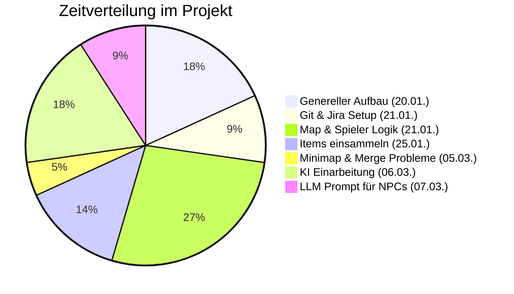

---

---
# 20.01. - 04:00 Jannis K.
- genereller Aufbau und Rundeinstellungen 
- erstellen der Scene und importieren der Grafiken 
- Zuschneiden und Anpassen der Grafiken 

# 21.01. - 02:00 Jannis K.
- git Setup (VCS)
- erstellen eines Jira board mit ersten Aufgaben 
- alles so gemacht, dass man als Team zusammen arbeiten kann

# 21.01. - 06:00 Jannis K.
- Map erstellt (verschiedene Ebenen)
- Spieler erstellt
- Spieler bewegung 
- Spieler Kollision mit Gegenstand
- reinarbeiten in Unity generell 

# 25.01. - 03:00 Jannis K.
- erstellen eines Items zum Einsammeln 
- man kann Items jetzt einsammeln und die werden entfernt von der map 
- im script ist eine liste, die zählt wie viele items man von welcher sorte hat

# 05.03. - 01:00 Jannis K. 
- erstellen einer Minimap 
- mit problemen bei mergen (05:00)

# 06.03. - 04:00 Jannis K.
- einarbeiten in KI in spielen 
- erste versuche der Implementierung (nichts hat so funktioniert wie es soll)
- ich habe nur ein LLM in python zum laufen bekomme 

# 07.03. - 02:00 Jannis K.
- Prompt für das LLM für den Dorfbewohner schreiben, der erklärt, wie das spiel funktioniert

---
# Probleme:

- git einrichten 
	- die Datein waren zu groß
	- haben dann zuerst das Unity version control system, nachdem Git nicht funktioniert hat
	- wir sind aber mit dem Unity version control system nicht so gut klar gekommen 
	- wir sind zurück auf git gewechselt und haben ein externen Server mit eingebunden, damit alles syncronisiert werden kann (LFS)

- Mergen der Minimap auf dev-v1
	- das sorgte dafür, dass die main scene gelöscht wurde und wir mussten das alles sehr umständlich wieder zurück machen

---
# Was haben wir gelernt?
- wir sollten egal wofür git benutzen
- wir müssen beim mergen von branches genauer kontrollieren was wir genehmigen